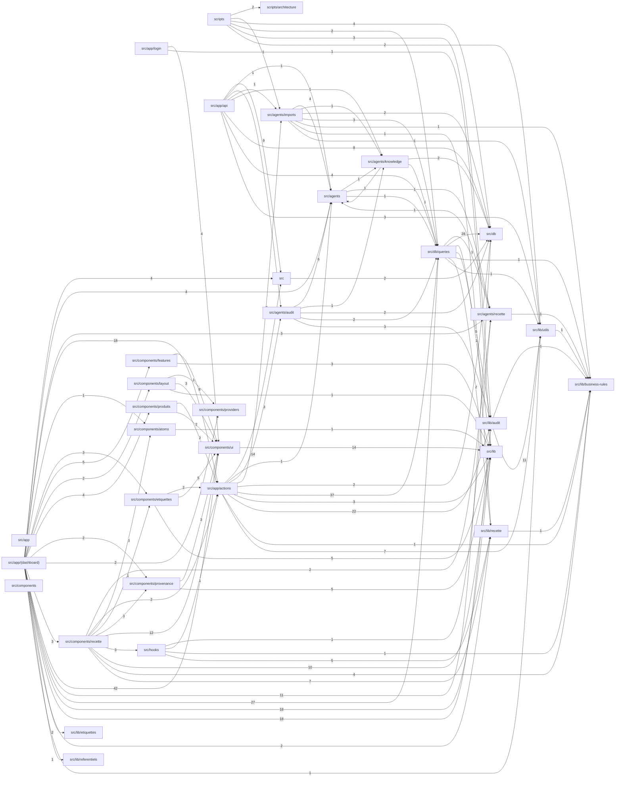

# Architecture — GaïaLabel

> **Fichier généré par `npm run arch:build` — ne pas modifier à la main.**
> Toute modification manuelle est écrasée à la prochaine génération et fait échouer `npm run arch:check`.
> La prose (rôle des modules, intentions) vit dans `docs/INTENTION.md`.
> Base : commit `b463b19` · généré le 2026-09-23

**233 fichiers · 30956 lignes** (src/, scripts/, drizzle/ — hors tests et fichiers de déclaration)

## Dépendances entre dossiers

Une flèche A → B : au moins un fichier de A importe un fichier de B. L'étiquette compte les imports.

## Modules

| Module | Fichiers | Lignes | Dépend de | Utilisé par |
|---|---:|---:|---|---|
| `scripts` | 4 | 353 | `scripts/architecture`, `src/agents/imports`, `src/db`, `src/db/queries`, `src/lib/audit`, `src/lib/utils` | — |
| `scripts/architecture` | 4 | 403 | — | `scripts` |
| `src` | 3 | 96 | `src/db` | `src/app/(dashboard)`, `src/app/actions`, `src/app/api` |
| `src/agents` | 7 | 811 | `src/agents/knowledge`, `src/agents/recette`, `src/db/queries` | `src/agents/audit`, `src/agents/imports`, `src/agents/knowledge`, `src/agents/recette`, `src/app/(dashboard)`, `src/app/actions`, `src/app/api` |
| `src/agents/audit` | 3 | 427 | `src/agents`, `src/agents/knowledge`, `src/db`, `src/db/queries`, `src/lib/audit` | `src/app/actions`, `src/app/api` |
| `src/agents/imports` | 3 | 1101 | `src/agents`, `src/agents/knowledge`, `src/db`, `src/db/queries`, `src/lib/business-rules`, `src/lib/recette`, `src/lib/utils` | `scripts`, `src/app/actions`, `src/app/api` |
| `src/agents/knowledge` | 1 | 155 | `src/agents`, `src/db`, `src/db/queries` | `src/agents`, `src/agents/audit`, `src/agents/imports`, `src/app/api` |
| `src/agents/recette` | 1 | 113 | `src/agents`, `src/lib/business-rules` | `src/agents`, `src/app/(dashboard)`, `src/components/recette`, `src/db/queries`, `src/hooks` |
| `src/app` | 1 | 34 | — | — |
| `src/app/(dashboard)` | 52 | 7033 | `src`, `src/agents`, `src/agents/recette`, `src/app/actions`, `src/components/atoms`, `src/components/etiquettes`, `src/components/features`, `src/components/layout`, `src/components/produits`, `src/components/provenance`, `src/components/providers`, `src/components/recette`, `src/components/ui`, `src/db`, `src/db/queries`, `src/lib`, `src/lib/audit`, `src/lib/etiquettes`, `src/lib/recette`, `src/lib/referentiels`, `src/lib/utils` | — |
| `src/app/actions` | 15 | 1899 | `src`, `src/agents`, `src/agents/audit`, `src/agents/imports`, `src/db`, `src/db/queries`, `src/lib`, `src/lib/audit`, `src/lib/business-rules`, `src/lib/utils` | `src/app/(dashboard)`, `src/components/etiquettes`, `src/components/produits`, `src/components/recette`, `src/hooks` |
| `src/app/api` | 10 | 495 | `src`, `src/agents`, `src/agents/audit`, `src/agents/imports`, `src/agents/knowledge`, `src/db`, `src/db/queries`, `src/lib/utils` | — |
| `src/app/login` | 2 | 142 | `src/components/ui`, `src/lib` | — |
| `src/components` | 1 | 45 | — | — |
| `src/components/atoms` | 2 | 148 | `src/lib` | `src/app/(dashboard)`, `src/components/recette` |
| `src/components/etiquettes` | 5 | 789 | `src/app/actions`, `src/components/ui`, `src/lib` | `src/app/(dashboard)`, `src/components/recette` |
| `src/components/features` | 4 | 641 | `src/components/ui`, `src/lib` | `src/app/(dashboard)` |
| `src/components/layout` | 2 | 216 | `src/components/providers`, `src/components/ui`, `src/lib` | `src/app/(dashboard)` |
| `src/components/produits` | 3 | 440 | `src/app/actions`, `src/components/ui` | `src/app/(dashboard)` |
| `src/components/provenance` | 3 | 187 | `src/components/ui`, `src/lib` | `src/app/(dashboard)`, `src/components/recette` |
| `src/components/providers` | 1 | 137 | — | `src/app/(dashboard)`, `src/components/layout` |
| `src/components/recette` | 12 | 1593 | `src/agents/recette`, `src/app/actions`, `src/components/atoms`, `src/components/etiquettes`, `src/components/provenance`, `src/components/ui`, `src/hooks`, `src/lib`, `src/lib/business-rules`, `src/lib/recette` | `src/app/(dashboard)` |
| `src/components/ui` | 15 | 1269 | `src/lib` | `src/app/(dashboard)`, `src/app/login`, `src/components/etiquettes`, `src/components/features`, `src/components/layout`, `src/components/produits`, `src/components/provenance`, `src/components/recette` |
| `src/db` | 5 | 893 | — | `scripts`, `src`, `src/agents/audit`, `src/agents/imports`, `src/agents/knowledge`, `src/app/(dashboard)`, `src/app/actions`, `src/app/api`, `src/db/queries` |
| `src/db/queries` | 14 | 2460 | `src/agents/recette`, `src/db`, `src/lib`, `src/lib/audit`, `src/lib/business-rules`, `src/lib/recette`, `src/lib/utils` | `scripts`, `src/agents`, `src/agents/audit`, `src/agents/imports`, `src/agents/knowledge`, `src/app/(dashboard)`, `src/app/actions`, `src/app/api` |
| `src/hooks` | 2 | 511 | `src/agents/recette`, `src/app/actions`, `src/lib/business-rules`, `src/lib/recette` | `src/components/recette` |
| `src/lib` | 3 | 64 | — | `src/app/(dashboard)`, `src/app/actions`, `src/app/login`, `src/components/atoms`, `src/components/etiquettes`, `src/components/features`, `src/components/layout`, `src/components/provenance`, `src/components/recette`, `src/components/ui`, `src/db/queries` |
| `src/lib/audit` | 29 | 5333 | `src/lib/business-rules`, `src/lib/utils` | `scripts`, `src/agents/audit`, `src/app/(dashboard)`, `src/app/actions`, `src/db/queries` |
| `src/lib/business-rules` | 6 | 535 | — | `src/agents/imports`, `src/agents/recette`, `src/app/actions`, `src/components/recette`, `src/db/queries`, `src/hooks`, `src/lib/audit`, `src/lib/recette`, `src/lib/utils` |
| `src/lib/etiquettes` | 1 | 36 | — | `src/app/(dashboard)` |
| `src/lib/recette` | 9 | 1237 | `src/lib/business-rules` | `src/agents/imports`, `src/app/(dashboard)`, `src/components/recette`, `src/db/queries`, `src/hooks` |
| `src/lib/referentiels` | 1 | 57 | — | `src/app/(dashboard)` |
| `src/lib/utils` | 9 | 1303 | `src/lib/business-rules` | `scripts`, `src/agents/imports`, `src/app/(dashboard)`, `src/app/actions`, `src/app/api`, `src/db/queries`, `src/lib/audit` |

## Fichiers au-delà du seuil

Fichiers de plus de 300 lignes. « Importé par » = nombre de fichiers qui l'importent.

| Fichier | Lignes | Importé par |
|---|---:|---:|
| `src/app/(dashboard)/etiquettes/[id]/EtiquetteClient.tsx` | 1447 | 1 |
| `src/agents/imports/importWorker.ts` | 802 | 2 |
| `src/db/queries/fiches.ts` | 707 | 9 |
| `src/db/schema.ts` | 651 | 34 |
| `src/lib/audit/visual/text-robot.ts` | 571 | 18 |
| `src/hooks/useCalculatrice.ts` | 394 | 2 |
| `src/db/queries/recettes.ts` | 382 | 6 |
| `src/lib/audit/types.ts` | 350 | 28 |
| `src/lib/audit/visual/typographie.ts` | 346 | 1 |
| `src/lib/audit/control-checklist.ts` | 337 | 5 |
| `src/lib/audit/visual/mentions-etiquette.ts` | 320 | 1 |
| `src/lib/audit/visual/positions.ts` | 320 | 1 |
| `src/app/(dashboard)/etiquettes/[id]/_components/bat-visionneuse.tsx` | 319 | 1 |
| `src/db/queries/produits.ts` | 302 | 13 |
| `src/components/recette/RecetteCalculatorRow.tsx` | 301 | 1 |
| `src/lib/audit/visual/propositions.ts` | 301 | 2 |

## Dépendances circulaires

Chaque groupe est un ensemble de fichiers qui s'importent mutuellement, directement ou non.

1. `src/lib/audit/visual/propositions.ts`, `src/lib/audit/visual/text-robot.ts`

## Points d'entrée

### Routes Next.js

| URL | Type | Fichier |
|---|---|---|
| `/archives` | page | `src/app/(dashboard)/archives/page.tsx` |
| `/commandes` | page | `src/app/(dashboard)/commandes/page.tsx` |
| `/connaissances` | page | `src/app/(dashboard)/connaissances/page.tsx` |
| `/controle-graphisme` | page | `src/app/(dashboard)/controle-graphisme/page.tsx` |
| `/etiquettes/[id]` | page | `src/app/(dashboard)/etiquettes/[id]/page.tsx` |
| `/etiquettes/nouveau` | page | `src/app/(dashboard)/etiquettes/nouveau/page.tsx` |
| `/etiquettes` | page | `src/app/(dashboard)/etiquettes/page.tsx` |
| `/` | layout | `src/app/(dashboard)/layout.tsx` |
| `/notifications` | page | `src/app/(dashboard)/notifications/page.tsx` |
| `/` | page | `src/app/(dashboard)/page.tsx` |
| `/parametres/consommation` | page | `src/app/(dashboard)/parametres/consommation/page.tsx` |
| `/parametres` | layout | `src/app/(dashboard)/parametres/layout.tsx` |
| `/parametres/matieres` | page | `src/app/(dashboard)/parametres/matieres/page.tsx` |
| `/parametres` | page | `src/app/(dashboard)/parametres/page.tsx` |
| `/produits` | page | `src/app/(dashboard)/produits/page.tsx` |
| `/provenance-demo` | page | `src/app/(dashboard)/provenance-demo/page.tsx` |
| `/referentiels/gammes` | page | `src/app/(dashboard)/referentiels/gammes/page.tsx` |
| `/referentiels` | layout | `src/app/(dashboard)/referentiels/layout.tsx` |
| `/referentiels/matieres` | page | `src/app/(dashboard)/referentiels/matieres/page.tsx` |
| `/referentiels` | page | `src/app/(dashboard)/referentiels/page.tsx` |
| `/api/agents/audit` | route | `src/app/api/agents/audit/route.ts` |
| `/api/agents/chat` | route | `src/app/api/agents/chat/route.ts` |
| `/api/agents/import` | route | `src/app/api/agents/import/route.ts` |
| `/api/auth/[...nextauth]` | route | `src/app/api/auth/[...nextauth]/route.ts` |
| `/api/bat/rendu` | route | `src/app/api/bat/rendu/route.ts` |
| `/api/knowledge/upload` | route | `src/app/api/knowledge/upload/route.ts` |
| `/api/notifications/read-all` | route | `src/app/api/notifications/read-all/route.ts` |
| `/api/notifications/read` | route | `src/app/api/notifications/read/route.ts` |
| `/api/notifications` | route | `src/app/api/notifications/route.ts` |
| `/api/notifications/stream` | route | `src/app/api/notifications/stream/route.ts` |
| `/` | layout | `src/app/layout.tsx` |
| `/login` | page | `src/app/login/page.tsx` |

### Server Actions (fichiers `"use server"`)

- `src/app/actions/archivage.ts`
- `src/app/actions/audit-visuel.ts`
- `src/app/actions/audit.ts`
- `src/app/actions/catalogue.ts`
- `src/app/actions/controle-graphisme.ts`
- `src/app/actions/etiquettes.ts`
- `src/app/actions/fiche-champs.ts`
- `src/app/actions/gammes.ts`
- `src/app/actions/import.ts`
- `src/app/actions/knowledge.ts`
- `src/app/actions/matieres.ts`
- `src/app/actions/proposition-fiche.ts`
- `src/app/actions/recette.ts`
- `src/app/actions/validation-controle.ts`
